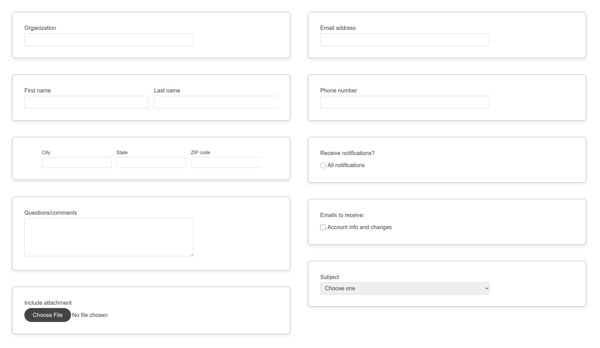

# Starter Form Components
## Standard form field components for digital forms, based on real-world design patterns

Made for building web forms, with common patterns that can be mixed and matched for any type of form.

### Features ###
- Responsive across screen sizes
- Dark mode compatibility
- Semantic code, optimized for accessibility
- Blocks Edit ready for drag and drop editing

## Commonly used components ##

Fields to collect information, for contact forms, surveys, etc.

